# Continual Learning Algorithms in PyTorch

This repository contains PyTorch implementations of some of the most common **Continual Learning (CL)** algorithms, including memory-based, distillation-based, and regularization-based approaches.

In **LifeLong Learning (LLL)**, we aim to learn to acheive good performance on multiple tasks, where the training is done sequentially.
$$
\Tau_1,\Tau_2,...,\Tau_n
$$

However, typical fine-tuning on $T_k$ causes **catastrophic forgetting** on all previous tasks $\Tau_{k-1},\Tau_{k-2},...,\Tau_1$; hence the need for a customized approach.

## Distillation-based Approaches

### [Learning without Forgetting (LwF)](https://arxiv.org/abs/1606.09282) 
After each task, copy the old model. Use this model as a distillation model, meaning that you should make sure that the soft logits of the new model don't go far away from the old one, maintaining good performance on the old tasks
$$
L = L_{task} + \lambda  L_{distill}
\\ \space
\\
L_{distill} = T^2  \space KL(\sigma(\frac{f_{\theta^*}}{T}) || \space  \sigma(\frac{f_\theta}{T}))

$$
Where $\theta^*$  is the old  network paramters and $\sigma$ is a softmax, and $T$ is thethe tempreture hyperparameter.

## Regularization-based Approaches

These methods, estimate the importance of parametrs on the prevoius task and apply a penalty to their change so the objective becomes:

$$

L = L_{task} + \lambda  L_{reg}
\\ \space
\\
L_{reg} = \Omega \space (\theta - \theta^*)^2

$$
Where $\theta^*$  is the old  network paramters and $\Omega$ is the parameter importance.

Now, the regularization approaches differ on how to estimate $\Omega$ and what is needed to estimate it.

### [Elastic Weights Consildation (EWC)](https://arxiv.org/abs/1612.00796)
Estimates the importance based on the sensetivity of the **Fisher Matrix**. We can also think of it as the change in the loss. So in simpler words:

"*The parameter whose change affects the loss drastically is important*"

The Fisher information matrix can be computed as follows:

$$
F = \nabla_{\theta} \log p(y|x,\theta)\space \nabla_{\theta} \log p(y|x,\theta)^T
$$

### [Memory Aware Synaps (MAS)](https://arxiv.org/abs/1711.09601)
Estimates the importance based on the sensetivity of the output itself. We can also think of it as the change in the logits. So in simpler words:

"*The parameter whose change affects the logits drastically is important*"

The estimation is done as follows:
$$
\Omega = \frac{1}{N} \sum_{k=1}^N|| g(x_k)||
\\ \space
\\
g(x_k)= \nabla_\theta f(x_k; \theta)
$$

If the output is multidimensional, take the $L_2$ norm.

> Note: this can be used for unlabled data since it's it doesn't need any lables for the estimation

## Memory-based Approaches
Those try to dedicate a small buffer (or memory) ***M*** to save some data samples from previous tasks.

There are multiple ways of choosing sampling the examples to ***M***, but we will follow uniform random sampling.

### [Experience Replay (ER)](https://arxiv.org/pdf/1902.10486)
The simplest method, basically train on both the current task and the memory buffer. 

### [Gradient Episodic Memory (GEM)](https://arxiv.org/abs/1706.08840)
Use the samples in ***M*** to enforce a constraint:
$$
L(f_\theta, M_k) \le L(f_\theta^{t-1},M_k) \space \forall k < t
$$
This means that the progress of the training should not increase the loss on the buffer containing the previous tasks. 

This is ensured if the inner product between the current gradient $g$ and every other gradient on task $k$, $g_k$ is greater than or equal zero.

$$
\langle g,g_k \rangle \ge 0, \forall k < t
$$

If any of those constrains are violated, $g$ is projected to the closest vector that satisfies the constraints. This is done by solving a **Quadratic  Program** (QP).

#### [Averaged Gradient Episodic Memory (A-GEM)](https://arxiv.org/abs/1812.00420)
The GEM QP is computationally heavy, not to mention the fact that since we have many constraints, the number of violations will be high, making the computation even heavier.

To resolve this, A-GEM takes a batch from ***M***  and computes the gradient $g_{ref}$ on it, (averaging the gradients of all previous tasks), then it enforces a single constraint:

$$
\langle g,g_{ref} \rangle \ge 0
$$

if the constraint is violated, the $g$ can be simply projected:
$$
\tilde{g} \leftarrow g - \frac{g^T \space g_{ref}}{g_{ref}^T \space g_{ref}} \space g_{ref}
$$
Then use $\tilde{g}$ for backprop.

# Evaluation
We first choose the metric of our task (e.g accuracy for classification), and then, after training on each task, we evaluate the accuracy on all tasks. Following this approach we can construct a matrix $R$ of size $n \times n$, where $n$ is the number of task, for $n=3$, we have:
$$
R =\begin{bmatrix}
    R_{11} & R_{12} & R_{13}\\ 
    R_{21} & R_{22} & R_{23}\\ 
    R_{31} & R_{32} & R_{33}\\ 
\end{bmatrix}
$$

where, $R_{i,j}$ is the model's accuracy on $\Tau_j$ after training on $\Tau_i$ . Using this matrix, we can extract :
- The **Average Accuracy (ACC)**:
    $$
        ACC = \frac{1}{n}\sum_{i=1}^n R_{n,i}
    $$
- The **Backward Transfer (BWT)**. Which reflects how the accuracy on the previous tasks improve, as we train on new tasks. A negative BWT indicates forgetting :
    $$
        BWT = \frac{1}{n-1}\sum_{i=1}^{n-1} R_{n,i} - R_{i,i}
    $$

# Experiments

All approaches are tested on PermutedMNIST, and RotatedMNIST. These datasets are widely used for evalauting continual learning algorithms. Each dataset contains 3 tasks.

We used a simpe CNN model of 6 convolutional layers and a linear classifier.
The methods were trained for both datasets twice, one for 1 epoch, and another for 5 epoches. This was done to see the effect of longer training on our apporoaches.

## PermutedMNIST
In this dataset, the pixels are permuted randomly for each task, creating a completely different dataset.

The choice of $\lambda$ was as follows: 
$$
\lambda = 0.07 \text{  for MAS} \\
\lambda = 1000 \text{  for EWC} \\
\lambda = 2.5 \text{For LwF}
$$
These values were chosen experimantally. They control the strictness not forgetting. when $\lambda$ is too high, the model will not learn new tasks, but when $\lambda$ is too low, the model will forget the old tasks.

### 1 Epoch

Reported below is the $R$ matrix of each method, when training for 1 epoch:

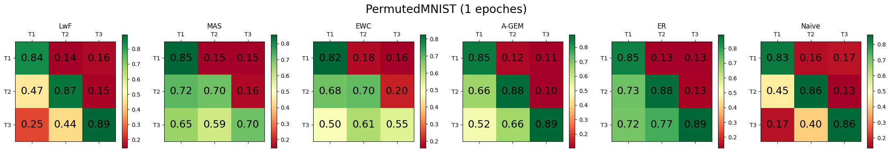

From these matrices we get the Backward Transfer (BWT):

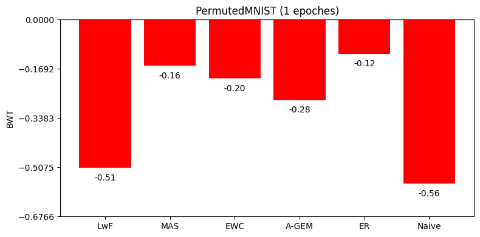

> Note: This is negative, because it represents forgetting. The shorter the bar, the better.

And the Average Accuracy (ACC):

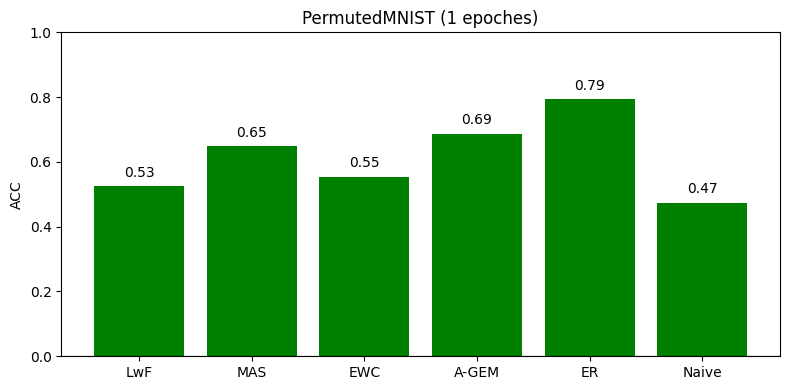

It appears that **ER** is taking the lead, followed by **Regularization Approaches** then **A-GEM** and lastly LwF (**Distillation Approach**). A training duration of a single epoch, ahieved a very acceptable performance. The **Naive** method here is typical fine-tuning.

### 5 Epoches
Reported below are the resulats of each method, when training for 5 epoches

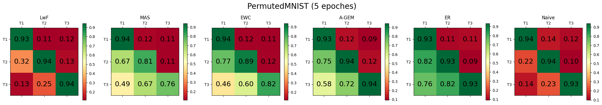

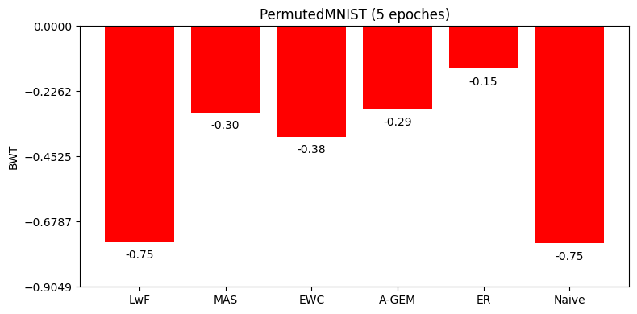

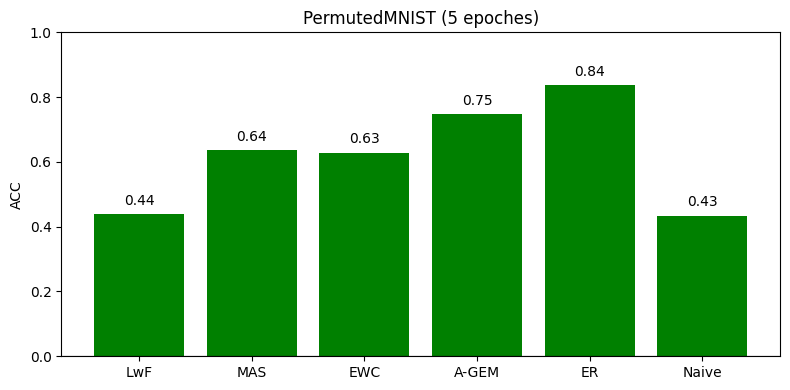

It appears that **Memory Approaches** are taking the lead, followed by **Regularization Approaches** and lastly LwF (**Distillation Approach**). Training for 5 epoches did not significantly improve the results. Also for **Regularization** and **Distillation**, longer training can cause divergence from the objective; hence more forgetting.

## RotatedMNIST
The MNIST images are rotated by some angle $\theta$, creating a different dataset.

The angles chosen are $[0,90,-90]$

The choice of $\lambda$ was as follows: 
$$
\lambda = 1 \space \text{  for MAS} \\
\lambda = 1000 \space \text{  for EWC} \\
\lambda = 2.5 \space \text{ for LwF}
$$
These values were chosen experimantally.

### 1 Epoch

Reported below are the resulats of each method, when training for 1 epoch:

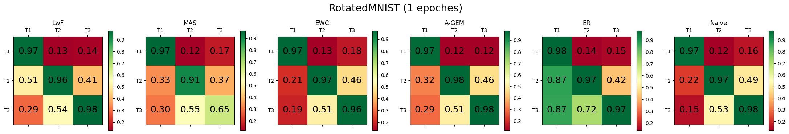

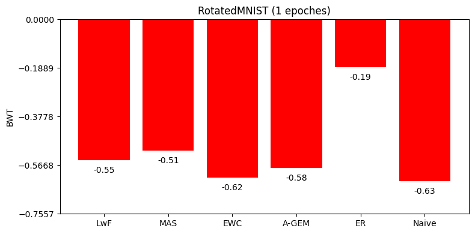

### 5 Epoches
Reported below are the resulats of each method, when training for 5 epoches

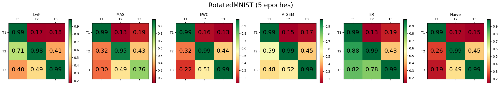

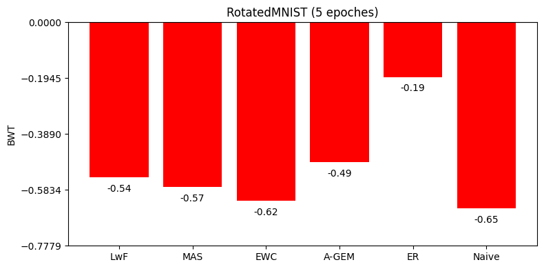

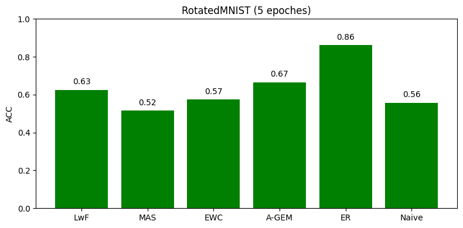

In this case, training longer didn't cause more forgetting, due to the fact that rotation doesn't change the distribution of data the same way that permutation does. For this reason, the difference between $\Tau_1$ and $\Tau_2$ is not that much.

